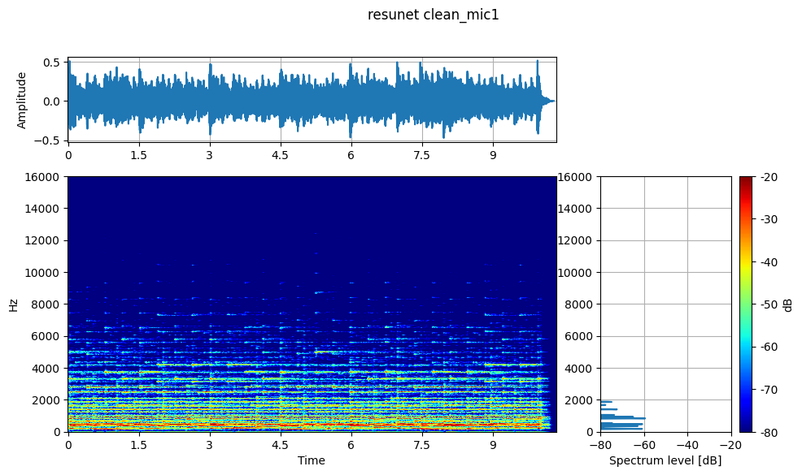
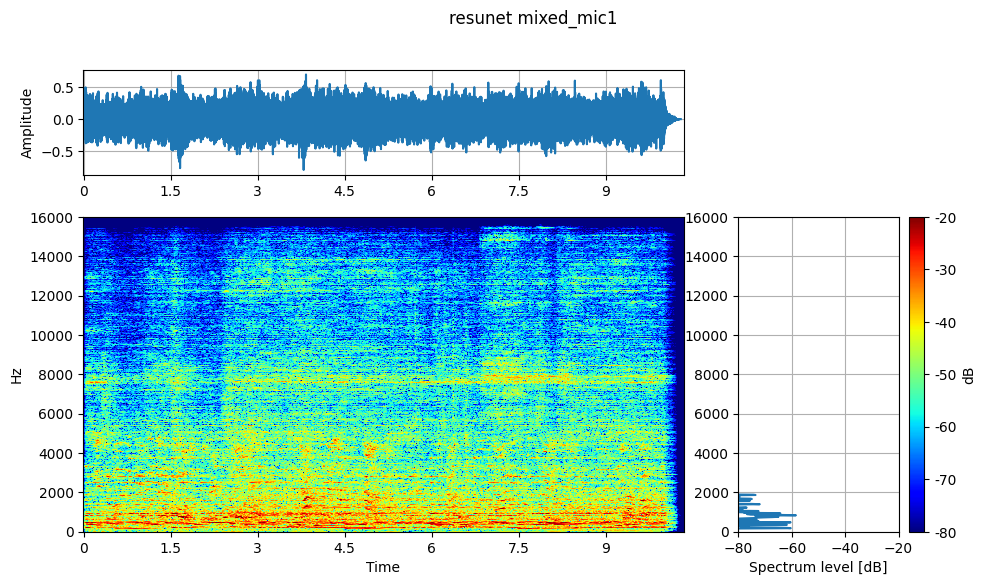
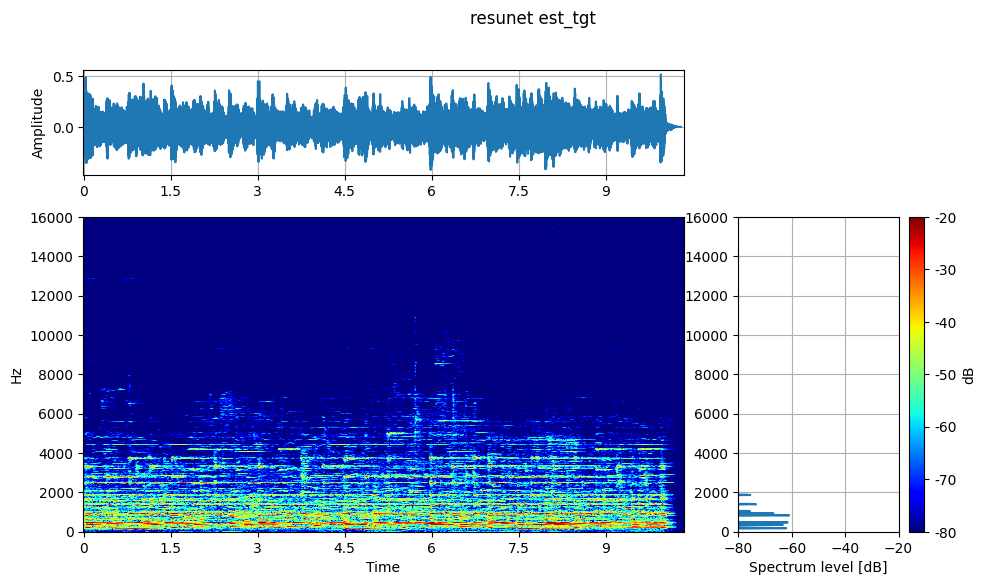

# SoundDiffSep

Sound Source Separation Method Based on Sound Pressure Difference

## 概要

SoundDiffSepは、分散配置された2本のマイクロフォンの音圧差を利用した音源分離手法です。一方のマイクに近い音源を強調し、他の音源や雑音を抑制することで、高品質な音源強調を実現します。

## 特徴

- **マルチマイク音源分離**: 分散配置された2本のマイクロフォンを使用
- **空間的位置関係の活用**: マイクと音源の距離の差による音圧差を利用した音源強調手法
- **深層学習モデル**: ResUNet、DCUNetなど複数のアーキテクチャをサポート
- **OverlapAdd処理**: 長時間音声の効率的な処理

### 対象音源

- 片方のマイクに近い音源を**ターゲット**として強調
- 遠方の音源を**ノイズ**として抑制
- 音源の種類（話者、楽器、環境音など）は問わず、**ユニバーサルサウンドセパレーション**に対応

## インストール

### 通常のインストール

```bash
git clone https://github.com/your-username/SoundDiffSep.git
cd SoundDiffSep
pip install -r requirements.txt
pip install -e .
```

### Dev Container（デブコンテナ）での環境構築

1. [Dev Containers 拡張機能](https://marketplace.visualstudio.com/items?itemName=ms-vscode-remote.remote-containers)をインストールしたVS Codeを用意します。
2. リポジトリをクローンし、VS Codeで開きます。
3. コマンドパレット（`F1` または `Ctrl+Shift+P`）で「Dev Containers: Reopen in Container」を選択します。
4. 自動的に依存関係がインストールされ、開発環境がセットアップされます。

> **備考:**  
> `.devcontainer` ディレクトリと `devcontainer.json` がプロジェクトに含まれている場合、その設定が利用されます。  
> 詳細は [Dev Containers ドキュメント](https://containers.dev/) を参照してください。

## 使用方法

### 基本的な音声分離

```python
from sounddiffsep.model_loader import easy_load_model, separate_audio
import numpy as np

# モデルの読み込み
model = easy_load_model("resunet", device="cuda")

# 2チャンネル音声データ（mixed_signal: メインマイク, noise_signal: 参照マイク）
result = separate_audio(
    mixed_signal=mixed_signal,  # shape: (samples,)
    noise_signal=noise_signal,   # shape: (samples,)
    model=model,
    device="cuda"
)

# 結果の取得
estimated_target = result["estimated_target"]  # 強調された音源
estimated_noise = result["estimated_noise"]    # 抑制されたノイズ
```

### OverlapAdd処理による長時間音声の処理

```python
from sounddiffsep.models.overlap_add import OverlapAdd

# OverlapAdd設定
window_size = 64000  # 2秒分のサンプル数（32kHz）
hop_size = window_size // 2
ola = OverlapAdd(window_size=window_size, hop_size=hop_size, window='hann')

# 長時間音声の効率的な処理
def process_long_audio(mixed, noise_clean, model, batch_size=32):
    """長時間音声をセグメント単位で処理"""
    # 詳細な実装は notebook/inference_test_ola.ipynb を参照
    pass
```

## 音響環境シミュレーション

### PyRoomAcousticsによる室内音響

本プロジェクトでは、現実的な音響環境での性能評価のため、PyRoomAcousticsを使用した室内音響シミュレーションを行います：

- **部屋設定**: 8m×8m、吸収率0.4、散乱率0.1
- **マイク配置**: 2チャンネル分散配置（[2,2]と[5,5]の位置）
- **音源配置**: ターゲット音源とノイズ音源を異なる位置に配置
- **反響**: 最大12次まで反射を考慮

```python
import pyroomacoustics as pra

# 8m×8mの部屋を作成
corners = np.array([[0, 0], [8, 0], [8, 8], [0, 8]]).T
room = pra.Room.from_corners(
    corners=corners,
    fs=32000,
    materials=pra.Material(0.4, 0.1),  # 吸収率、散乱率
    max_order=12
)

# マイクを配置 - 分散配置された2本のマイクロフォン
mic_positions = np.array([[2.0, 2.0], [5.0, 5.0]]).T
room.add_microphone_array(mic_positions)

# 音源を配置
source_positions = [[3.0, 3.0], [6.0, 6.0], [4.0, 4.0]]
for position, signal in zip(source_positions, source_signals):
    room.add_source(position, signal=signal)
```

## 実験・評価

### ノートブック

- [`notebook/inference_test_ola.ipynb`](notebook/inference_test_ola.ipynb): OverlapAdd処理による推論テスト
- [`notebook/audio_separation_model_comparison.ipynb`](notebook/audio_separation_model_comparison.ipynb): 複数モデルの性能比較

### 評価指標

- **SDR (Signal-to-Distortion Ratio)**: 信号対歪み比
- **SDRi (SDR improvement)**: SDR改善量
- **処理時間**: リアルタイム性能の評価

### モデルアーキテクチャ

#### サポートモデル

- **ResUNet**: 残差接続を持つU-Net構造
- **DCUNet**: Deep Complex U-Net
- **DCUNet-16**: 軽量版DCUNet（16チャンネル）
- **DCUNet-20**: 標準DCUNet（20チャンネル）
- **Large-DCUNet-20**: 大規模DCUNet

#### モデル読み込み例

```python
from sounddiffsep.model_loader import easy_load_model

# 利用可能なモデル
models = {}
for model_type in ["DCUNet-16", "DCUNet-20", "Large-DCUNet-20", "resunet"]:
    models[model_type] = easy_load_model(model_type, device="cuda")
```

#### モデル比較実験

複数のアーキテクチャ性能の簡易比較評価：


#### ResUnetの音源強調例

**ターゲット音源（クリーンな音源）:**


[🔊 tgt.wav](audio/tgt.wav)

**混合音源（ノイズ混入）:**


[🔊 mix.wav](audio/mix.wav)

**分離された音源（推定結果）:**


[🔊 est_tgt.wav](audio/est_tgt.wav)

## ファインチューニング

```python
from sounddiffsep.finetuning import main

# 設定ファイルによるファインチューニング実行
config = {
    "data": {"sample_rate": 32000, "n_src": 2},
    "training": {"batch_size": 16, "num_workers": 4},
    "optim": {"lr": 1e-4},
    # 詳細設定...
}

main(config)
```

## ディレクトリ構造

```text

SoundDiffSep/
├── sounddiffsep/                  # メインライブラリ
│   ├── data_utils/                # データセット関連
│   ├── models/                    # モデル定義
│   └── model_loader.py            # モデル読み込み
├── notebook/                      # 実験ノートブック
│   ├── inference_test_ola.ipynb
│   └── audio_separation_model_comparison.ipynb
└── data/                          # 音声データ
    ├── target.flac                # ターゲット音源
    ├── noise1.flac                # ノイズ音源1
    └── noise2.flac                # ノイズ音源2

```

## 謝辞

本プロジェクトは以下のオープンソースプロジェクトを基盤として開発されています：

- **[Asteroid](https://github.com/asteroid-team/asteroid/)**: 音声分離フレームワークとして利用。DCUNetなどのモデル実装とトレーニングパイプラインの基盤として使用
- **[AudioSep](https://github.com/Audio-AGI/AudioSep)**: ResUNetモデルの実装を利用。本プロジェクトではこれらの事前学習済みモデルをファインチューニングして使用

これらの優れたライブラリとモデル実装の提供に深く感謝いたします。

## ライセンス

このプロジェクトは[LICENSE](LICENSE)ファイルに記載されたライセンスの下で公開されています。

## 貢献

プルリクエストやイシューの報告を歓迎します。詳細な貢献ガイドラインについては、プロジェクトのガイドラインを参照してください。

## 引用

この研究を使用する場合は、以下の形式で引用してください：

```bibtex
@misc{sounddiffsep2025,
  title={SoundDiffSep: Sound Source Separation Method Based on Sound Pressure Difference},
  author={kasahart},
  year={2025},
  url={https://github.com/kasahart/SoundDiffSep}
}
```
