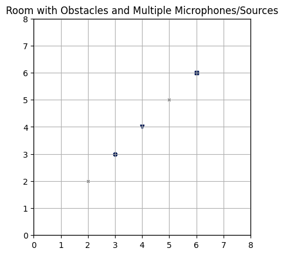
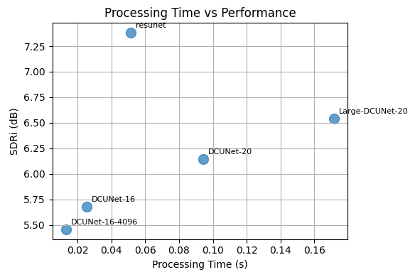
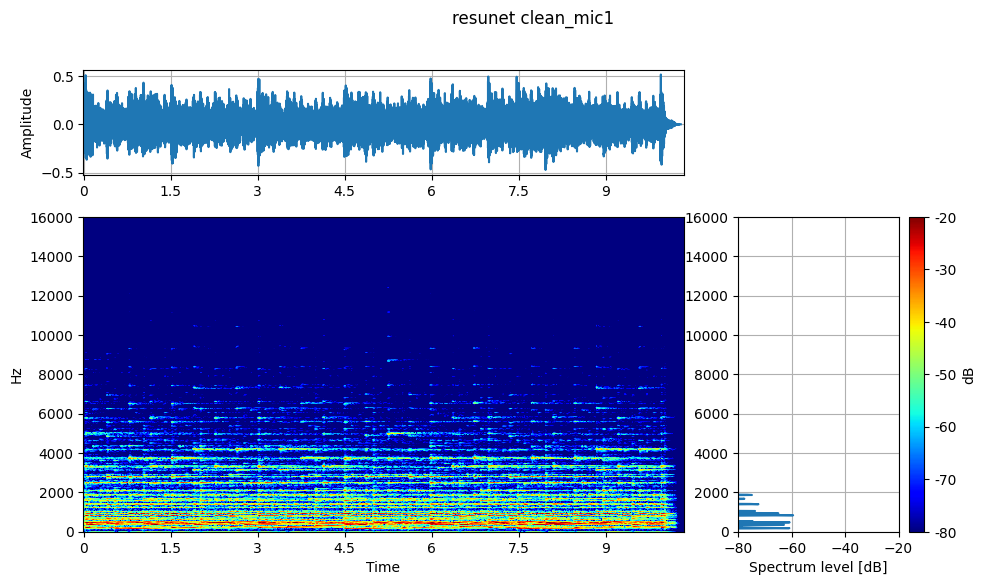
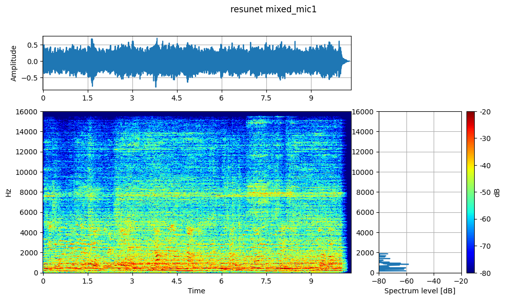
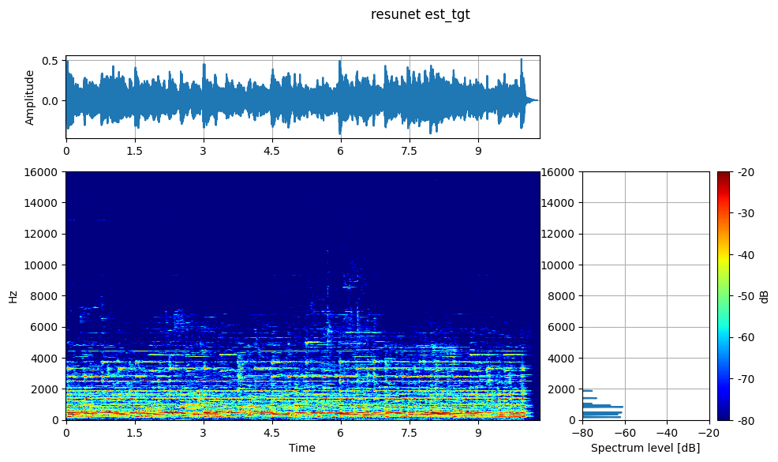

# SoundDiffSep

English | [日本語](README.ja.md)

Sound Source Separation Method Based on Sound Pressure Difference

## Overview

SoundDiffSep is a sound source separation method that uses the sound pressure difference between two distributed microphones. It enhances the sound source located near one microphone while suppressing other sources and noise, enabling high-quality source enhancement.

## Features

- **Multi-microphone source separation**: Uses two distributed microphones
- **Use of spatial relationships**: Enhances sources by leveraging sound pressure differences caused by distance differences between microphones and sound sources
- **Deep learning models**: Supports multiple architectures, including ResUNet and DCUNet
- **OverlapAdd processing**: Efficient processing for long audio recordings

### Target Sources

- Enhances the source close to one microphone as the **target**
- Suppresses distant sources as **noise**
- Supports **universal sound separation** regardless of source type, such as speakers, instruments, or environmental sounds

## Installation

### Standard Installation

```bash
git clone https://github.com/your-username/SoundDiffSep.git
cd SoundDiffSep
pip install -r requirements.txt
pip install -e .
```

### Setting Up with a Dev Container

1. Prepare VS Code with the [Dev Containers extension](https://marketplace.visualstudio.com/items?itemName=ms-vscode-remote.remote-containers) installed.
2. Clone the repository and open it in VS Code.
3. Open the command palette (`F1` or `Ctrl+Shift+P`) and select “Dev Containers: Reopen in Container”.
4. Dependencies are installed automatically and the development environment is set up.

> **Note:**
> If the project includes a `.devcontainer` directory and `devcontainer.json`, those settings are used.
> For details, see the [Dev Containers documentation](https://containers.dev/).

## Usage

### Basic Audio Separation

```python
from sounddiffsep.model_loader import easy_load_model, separate_audio
import numpy as np

# Load the model
model = easy_load_model("resunet", device="cuda")

# Two-channel audio data (mixed_signal: main microphone, noise_signal: reference microphone)
result = separate_audio(
    mixed_signal=mixed_signal,  # shape: (samples,)
    noise_signal=noise_signal,   # shape: (samples,)
    model=model,
    device="cuda"
)

# Retrieve the results
estimated_target = result["estimated_target"]  # enhanced source
estimated_noise = result["estimated_noise"]    # suppressed noise
```

### Processing Long Audio with OverlapAdd

```python
from sounddiffsep.models.overlap_add import OverlapAdd

# OverlapAdd settings
window_size = 64000  # number of samples for 2 seconds (32 kHz)
hop_size = window_size // 2
ola = OverlapAdd(window_size=window_size, hop_size=hop_size, window='hann')

# Efficient processing for long audio
def process_long_audio(mixed, noise_clean, model, batch_size=32):
    """Process long audio segment by segment"""
    # See notebook/inference_test_ola.ipynb for a detailed implementation
    pass
```

## Quick Experiments and Evaluation

### Notebooks

- [`notebook/inference_test_ola.ipynb`](notebook/inference_test_ola.ipynb): Inference test using OverlapAdd processing
- [`notebook/audio_separation_model_comparison.ipynb`](notebook/audio_separation_model_comparison.ipynb): Performance comparison across multiple models

### Room Acoustics Simulation with PyRoomAcoustics

This project uses room acoustics simulations with PyRoomAcoustics to evaluate performance in realistic acoustic environments:

- **Room settings**: 8 m × 8 m, absorption coefficient 0.4, scattering coefficient 0.1
- **Microphone placement**: Two-channel distributed placement (positions [2,2] and [5,5])
- **Source placement**: Target and noise sources are placed at different positions
- **Reflections**: Reflections are considered up to the 12th order

```python
import pyroomacoustics as pra

# Create an 8 m × 8 m room
corners = np.array([[0, 0], [8, 0], [8, 8], [0, 8]]).T
room = pra.Room.from_corners(
    corners=corners,
    fs=32000,
    materials=pra.Material(0.4, 0.1),  # absorption coefficient, scattering coefficient
    max_order=12
)

# Place microphones - two distributed microphones
mic_positions = np.array([[2.0, 2.0], [5.0, 5.0]]).T
room.add_microphone_array(mic_positions)

# Place sources
source_positions = [[3.0, 3.0], [6.0, 6.0], [4.0, 4.0]]
for position, signal in zip(source_positions, source_signals):
    room.add_source(position, signal=signal)
```



The source placed at [3,3] is enhanced from the recording captured by the microphone placed at [2.0, 2.0].

### Evaluation Metrics

- **SDR (Signal-to-Distortion Ratio)**: Signal-to-distortion ratio
- **SDRi (SDR improvement)**: Amount of SDR improvement
- **Processing time**: Evaluation of real-time performance

### Model Architectures

#### Supported Models

- **ResUNet**: U-Net structure with residual connections
- **DCUNet**: Deep Complex U-Net
- **DCUNet-16**: Lightweight DCUNet (16 layers)
- **DCUNet-20**: Standard DCUNet (20 layers)
- **Large-DCUNet-20**: Large-scale DCUNet (20 layers)

#### Model Loading Example

```python
from sounddiffsep.model_loader import easy_load_model

# Available models
models = {}
for model_type in ["DCUNet-16", "DCUNet-20", "Large-DCUNet-20", "resunet"]:
    models[model_type] = easy_load_model(model_type, device="cuda")
```

#### Model Comparison Experiment

Simple comparative evaluation of performance across multiple architectures:


#### ResUNet Source Enhancement Example

**Target source (clean source):**


[🔊 tgt.wav](audio/tgt.wav)

**Mixed source (with noise):**


[🔊 mix.wav](audio/mix.wav)

**Separated source (estimated result):**


[🔊 est_tgt.wav](audio/est_tgt.wav)

## Fine-tuning

```python
from sounddiffsep.finetuning import main

# Run fine-tuning with a configuration file
config = {
    "data": {"sample_rate": 32000, "n_src": 2},
    "training": {"batch_size": 16, "num_workers": 4},
    "optim": {"lr": 1e-4},
    # Additional settings...
}

main(config)
```

## Directory Structure

```text

SoundDiffSep/
├── sounddiffsep/                  # main library
│   ├── data_utils/                # dataset-related utilities
│   ├── models/                    # model definitions
│   └── model_loader.py            # model loading
├── notebook/                      # experiment notebooks
│   ├── inference_test_ola.ipynb
│   └── audio_separation_model_comparison.ipynb
└── data/                          # audio data
    ├── target.flac                # target source
    ├── noise1.flac                # noise source 1
    └── noise2.flac                # noise source 2

```

## Acknowledgements

This project is built on the following open-source projects:

- **[Asteroid](https://github.com/asteroid-team/asteroid/)**: Used as a speech separation framework. It serves as the foundation for model implementations such as DCUNet and for the training pipeline
- **[AudioSep](https://github.com/Audio-AGI/AudioSep)**: Uses the ResUNet model implementation. In this project, these pretrained models are fine-tuned and used

We deeply appreciate the excellent libraries and model implementations provided by these projects.

## License

This project is released under the license described in the [LICENSE](LICENSE) file.

## Contributing

Pull requests and issue reports are welcome. For detailed contribution guidelines, please refer to the project guidelines.

## Citation

If you use this research, please cite it in the following format:

```bibtex
@misc{sounddiffsep2025,
  title={SoundDiffSep: Sound Source Separation Method Based on Sound Pressure Difference},
  author={kasahart},
  year={2025},
  url={https://github.com/kasahart/SoundDiffSep}
}
```
